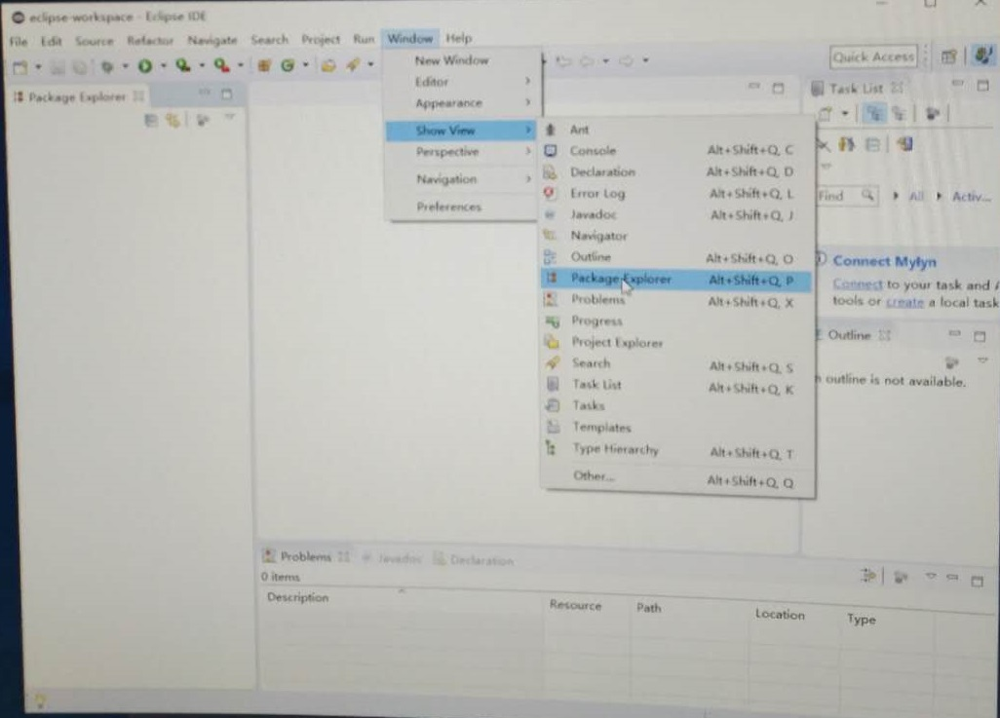

# Java 基础入门：入门篇（试学）
## 第一章：用程序来做计算
### 1.1 第一个Java程序
#### 1.1.1 准备编程软件
##### 1.1.1.1 Window 下如何安装 Eclipse  
1. 登录到 Eclipse.org 官网。  
注：下载软件要培养的习惯：1）下载软件要到官网去下，会下到最新的和最纯净的；2） 要适应阅读英文的网站和文献，它们使用的主要是常用单词，不会太难。
2. 在右上角点击 DOWNLOAD 按钮，然后在打开的界面中选择 Eclipse IDE for Java Developers（最新版的是Eclipse IDE 2018-12）。网站更新，界面可能不一样。最后显示捐赠页面，可以根据自己的情况选择捐赠或者不捐。
3. 下载的安装包是 eclipse-inst-win64.exe。双击，打开安装界面，如下图。单击选择 Eclipse IDE for Java Developers。并选择安装路径，这里选择默认。然后接受协议。点击安装，等待安装完成。

4. 安装完成打开界面如下。

如果没出现 Package Explorer，可以按如下图调出 Package Explorer。

5. 如果需要下载 JRE 的话，到官网 www.oracle.com 下载 JRE。

#### 1.1.2 Mac OS 上的编程软件
##### 1.1.2.1 Mac 如何安装 Eclipse
1. 在浏览器中输入网址 eclipse.org，打开官网。
2. 点击 DOWNLOAD 按钮，进行下载。注意官网的提示。
3. 按照提示默认安装就行。

#### 1.1.3 第一个 Java 程序
##### 1.1.3.1 写一个 Java 程序
1. File --> New --> Java Project，这里 project name 输入hello。可以设置其他选项，这里直接 Finish。
2. 在左边的 Package Explorer 下可以看到新建的 hello 项目。然后在 hello 项目下的 src 文件夹中可以写入代码。右键点击 src，选择 New --> Class，新建一个类。这里其他选项可以默认，Name 栏输入 Hello。**类的名字一般都会大写**。并且在下面勾选 public static void main(String[] args)，如下图

3. 在 main 函数中输入代码，**例如输入 System，只需要输入 Sys，然后 alt + / 就会弹出提示框。** 选择需要的选项，可以双击，也可以箭头加回车。
4. 输入代码 System.out.println("hello world")，使用 alt + /来进行提示。类的名称前有星号*，表示文件还没有保存，ctrl + s 进行保存。
5. 如何运行程序？在左上角有一个 run 按钮，点击即可运行。  

6. 中间的是编辑区域，是写源代码的地方；左边的是 Package Exploere，展式工程的内容；下面有不同的页，其中有一个业叫 Console，这个页就是程序运行的地方。

7. 如果在代码行左边出现红色的×，表示这一行有错误。鼠标放在上面，会提示错误信息。
8. 在双引号中间可以出现中文，但是在双引号外面不要出现中文信息。注释也最好使用英文。

### 1.2 用变量做计算
#### 1.2.1 输入
1. 首先创建输入 Scanner in = new Scanner(System.in); 使用 alt + / 进行提示。
2. 再输入 System.out.println(in.nextLine()); 然后在 Console 页面点击，使光标聚焦在 Console 页面。
3. 输入hello，并按回车，会显示 hello。

4. 如果多次运行同一个程序，并且程序没有关闭，会出现如下情况。

初学者很容易犯得一个错误就是程序有输入，程序等待用户输入的过程中，程序还没有运行结束，用户因为运行结束，就又开启一个程序。每一次启动一个程序就会有很多资源要被使用q 去运行你的程序，当程序运行的越来越多，最后你的 Eclipse 就运行跑不动了。当运行程序后没有反应时，可以到这里来看看是不是运行太多程序。
5. 可以使用“+”连接两个字符串，如果不是字符串，也会自动把内容变成字符串。
6. 由于运算的优先级，有些计算需要使用括号来保证运算顺序。

#### 1.2.2 变量
使用用户输入的数字来进行计算。

#### 1.2.3 赋值

### 1.3 表达式（浮点数、优先级和类型转换）
#### 1.3.1 浮点数
1. 任何程序都必须要有输入、计算、以及输出。可能计算需要的时间很长久。

2. 若想知道自己输入是否有错，可以把输入打印出来。
3. 整型与整型的运算结果只能是整型。**可以使用 double 表示浮点型**。

#### 1.3.2 优先级
1. java 运算符优先级就是正常的思维，怎么想的就怎么写。

#### 1.3.3 类型转换
1. 强制类型转换

### 1.4 如何做编程作业
#### 1.4.1 如何交作业

## 第二章：判断
### 2.1 作比较
#### 2.1.1 比较

#### 2.1.2 关系运算
### 2.2 判断语句
#### 2.2.1 做判断
#### 2.2.2 判断语句
#### 2.2.3 嵌套和级联的判断
#### 2.2.4 判断语句的常见问题
### 2.3 多路分支
#### 2.3.1 多路分支

## 第三章：循环
### 3.1 循环（while和do-while循环）
#### 3.1.1 循环
#### 3.1.2 数数字
#### 3.1.3 while循环
#### 3.1.4 do-while循环
### 3.2 for循环
#### 3.2.1 for循环
#### 3.2.2 复合赋值
### 3.3 循环控制（含复合赋值、逻辑类型）
#### 3.3.1 循环控制
#### 3.3.2 多重循环
#### 3.3.3 逻辑类型
### 3.4 循环应用
#### 3.4.1 计数循环
#### 3.4.2 算平均数
#### 3.4.3 猜数游戏
#### 3.4.4 整数分解
#### 3.4.5 求和
#### 3.4.6 最大公约数
### 3.5 《循环》编程练习
#### 3.5.1 《循环》编程练习题

## 第四章：数组
### 4.1 数组的创建和使用
#### 4.1.1 初试数组
#### 4.1.2 创建数组
#### 4.1.3 数组的元素
#### 4.1.4 投票统计
### 4.2 数组变量和运算
#### 4.2.1 数组变量
#### 4.2.2 遍历数组
#### 4.2.3 素数
### 4.3 二维数组
#### 4.3.1 二维数组
### 4.4 《数组》编程练习
#### 4.4.1《数组》编程练习题

## 第五章：函数
### 5.1 函数的定义和调用
#### 5.1.1 定义函数
#### 5.1.2 调用函数
### 5.2 函数的参数和本地变量
#### 5.2.1 参数传递
#### 5.2.2 本地变量
### 5.3 《函数》编程练习
#### 5.3.1 《函数》编程练习题

## 第六章 使用对象
### 6.1 字符类型
#### 6.1.1 字符类型
#### 6.1.2 逃逸字符
### 6.2 包裹类型
#### 6.2.1 包裹类型
### 6.3 字符串类型
#### 6.3.1 字符串变量
#### 6.3.2 字符串操作
### 6.4 Math类
#### 6.4.1 Math类
### 6.5 《使用对象》编程练习
#### 6.5.1 《使用对象》编程练习题
